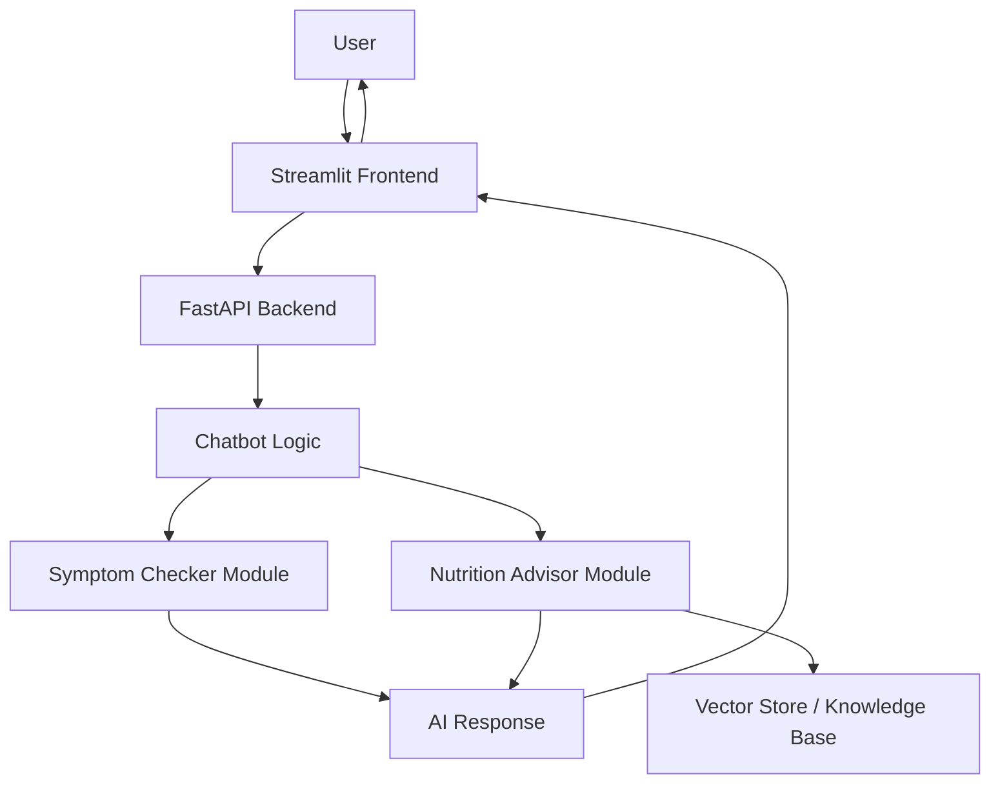

# Sakhi — Maternal Care Assistant

Sakhi is an AI-powered maternal care assistant designed to support pregnant women with accessible health guidance, symptom awareness, and nutrition recommendations.

The project is built as a modular Python application with a Streamlit frontend, FastAPI backend, and separate AI modules for symptom checking and nutrition advisory.

> **Note:** Sakhi is an educational and assistive AI project. It is not a replacement for professional medical diagnosis, emergency care, or consultation with a qualified doctor.

---

## Project Overview

Many pregnant women need quick, understandable, and accessible guidance for basic maternal health questions. Sakhi aims to provide a simple AI assistant that can:

- Help users understand common pregnancy-related symptoms
- Provide basic risk-awareness guidance
- Suggest nutrition-related information
- Offer a conversational interface for maternal care support
- Organize health-assistant logic into separate reusable modules

---

## Key Features

### 1. Symptom Checker

The Symptom Checker module helps users describe pregnancy-related symptoms and receive basic guidance.

It can assist with:

- Understanding possible causes of common symptoms
- Identifying when a symptom may require medical attention
- Giving safe next-step suggestions
- Encouraging doctor consultation for serious symptoms

### 2. Nutrition Advisor

The Nutrition Advisor module provides pregnancy-focused nutrition suggestions.

It can assist with:

- Food recommendations during pregnancy
- Nutritional awareness
- General dietary guidance
- Context-aware responses using a vector knowledge base

### 3. Streamlit Frontend

The frontend provides a simple user interface where users can interact with Sakhi.

Typical frontend file:

```bash
frontend_app.py
```

### 4. FastAPI Backend

The backend exposes API endpoints and connects the frontend with the AI modules.

Typical backend file:

```bash
main.py
```

### 5. Modular Project Structure

The project is divided into independent modules so that each assistant capability can be developed and improved separately.

---

## Tech Stack

| Layer | Technology |
|---|---|
| Programming Language | Python |
| Frontend | Streamlit |
| Backend | FastAPI |
| AI Framework | LangChain |
| Vector Database | Chroma |
| Embeddings | Sentence Transformers / Hugging Face |
| Local LLM Runtime | Ollama |
| API Server | Uvicorn |

---

## Folder Structure

```bash
Sakhi---Maternal-Care-Assistant/
│
├── frontend_app.py
├── main.py
├── chatbot.py
├── requirements.txt
├── README.md
│
├── NUTRITION_ADVISOR/
│   ├── ...
│   └── vector_store/
│
├── SYMPTOM_CHECKER/
│   └── ...
│
├── SHARED/
│   └── ...
│
└── .env
```

---

## Installation

### 1. Clone the Repository

```bash
git clone https://github.com/winterbeer/Sakhi---Maternal-Care-Assistant.git
cd Sakhi---Maternal-Care-Assistant
```

### 2. Create a Virtual Environment

For Windows:

```bash
python -m venv venv
venv\Scripts\activate
```

For macOS/Linux:

```bash
python3 -m venv venv
source venv/bin/activate
```

### 3. Install Dependencies

```bash
pip install -r requirements.txt
```

---

## Environment Variables

Create a `.env` file in the root directory.

Example:

```env
HUGGINGFACEHUB_API_TOKEN=your_hugging_face_api_key_here
```

Do not commit your `.env` file to GitHub.

Add this to `.gitignore`:

```bash
.env
venv/
__pycache__/
*.pyc
```

---

## Running the Project

### Start the FastAPI Backend

```bash
uvicorn main:app --reload
```

Backend will usually run at:

```bash
http://127.0.0.1:8000
```

FastAPI docs:

```bash
http://127.0.0.1:8000/docs
```

### Start the Streamlit Frontend

Open a second terminal and run:

```bash
streamlit run frontend_app.py
```

Streamlit will usually run at:

```bash
http://localhost:8501
```

---

## How It Works



---

## Use Cases

Sakhi can be used for:

- Maternal health awareness
- Pregnancy symptom guidance
- Nutrition support
- AI healthcare assistant demonstration
- RAG-based healthcare chatbot learning
- Portfolio project for AI, FastAPI, Streamlit, and LangChain

---

## Important Medical Disclaimer

Sakhi does not provide medical diagnosis.

Users should immediately contact a doctor, hospital, or emergency service if they experience symptoms such as:

- Heavy bleeding
- Severe abdominal pain
- Fainting
- Severe headache or blurred vision
- Difficulty breathing
- Reduced fetal movement
- High fever
- Seizures
- Any emergency condition

The assistant should only be used for basic awareness and guidance.

---

## Future Improvements

Planned improvements may include:

- Better frontend UI/UX
- Doctor/hospital contact recommendation flow
- Multi-language support
- Pregnancy week-based guidance
- Emergency triage workflow
- User history and session memory
- More structured nutrition plans
- Admin dashboard
- Cloud deployment
- Authentication and secure user data handling

---

## Contribution

Contributions are welcome.

To contribute:

1. Fork the repository
2. Create a new branch
3. Make your changes
4. Commit your work
5. Open a pull request

```bash
git checkout -b feature/your-feature-name
git add .
git commit -m "Add your feature"
git push origin feature/your-feature-name
```

---

## License

This project is for educational and portfolio purposes.  


---

## Author

Created by **winterbeer**

GitHub: [winterbeer](https://github.com/winterbeer)

---

## Repository

[https://github.com/winterbeer/Sakhi---Maternal-Care-Assistant](https://github.com/winterbeer/Sakhi---Maternal-Care-Assistant)
